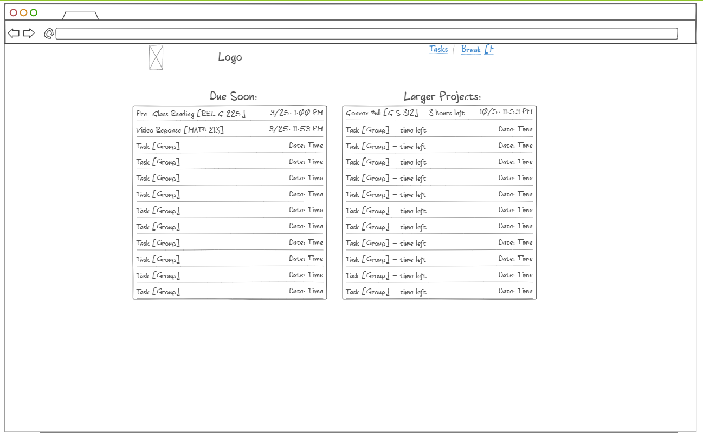

# Productivity Manager

## Description deliverable

### Elevator pitch

Have you ever had too many small items on your plate and couldn't keep track of all of them? Have you ever wanted to take a break but constantly find the breaks lasting too long? The Productivity Manager can keep track of all of your small projects for you, including when you need to complete them and about how long you estimate you have to work on them. It also has a section for small, fun activites during a break, but doesn't allow you to start new activities after your break is over, until you work on another project. This is especially designed for college students, but would be applicable with anyone struggling to keep track of their tasks

### Design

### Key features

- Secure login over HTTPS
- Ability to enter in your projects and how long you expect them to take
- Multiple displays of everything being tracked, as well as ability to group tasks (by class if a student)
- Ability to take breaks with small, fun activities
- Ability to set a limit on how long the break can be
- Ability to set a minimum time before allowing another break
- Tasks are persistently stored
- Ability for multiplayer game(s) during breaks

### Technologies

I am going to use the required technologies in the following ways.

- **HTML** - Uses correct HTML structure for application. At least three HTML pages, or perhaps just one with clever JavaScript display. One for login, one for tasks and one for breaks.
- **CSS** - Application styling that looks good on different screen sizes, uses good whitespace, color choice and contrast.
- **JavaScript** - Provides login, task display, break activities, backend endpoint calls.
- **Service** - Backend service with endpoints for:
  - login
  - storing and modifying tasks
  - retrieving tasks
- **DB** - Store users, tasks, and multiplayer games in database.
- **Login** - Register and login users. Credentials securely stored in database. Can add sample tasks if not logged in, but tasks will not be stored in database unless authenticated
- **WebSocket** - Multiplayer game(s) in break section
- **React** - Application ported to use the React web framework.