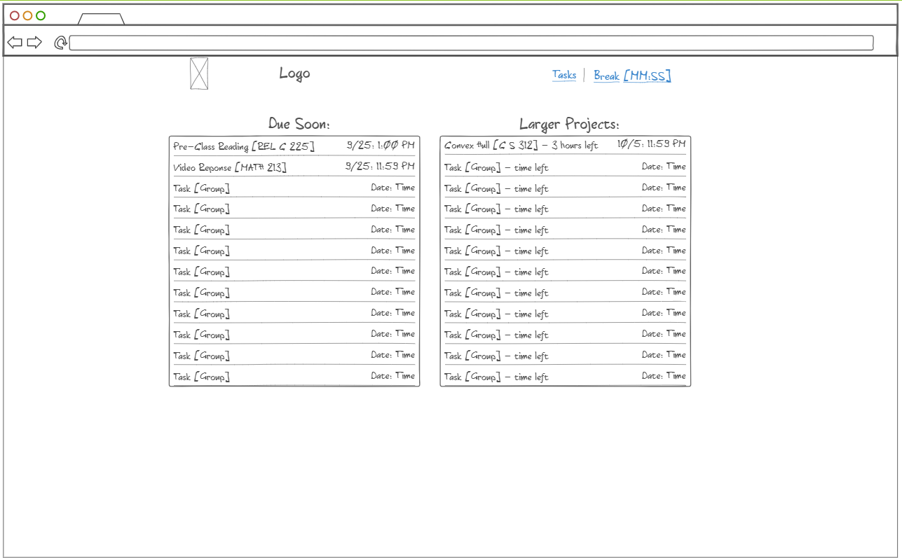

# Productivity Manager

## Description deliverable

### Elevator pitch

Have you ever had too many small items on your plate and couldn't keep track of all of them? Have you ever wanted to take a break but constantly find the breaks lasting too long? The Productivity Manager can keep track of all of your small projects for you, including when you need to complete them and about how long you estimate you have to work on them. It also has a section for small, fun activites during a break, but doesn't allow you to start new activities after your break is over, until you work on another project. This is especially designed for college students, but would be applicable with anyone struggling to keep track of their tasks

### Design

### Key features

- Secure login over HTTPS
- Ability to enter in your projects and how long you expect them to take
- Multiple displays of everything being tracked, as well as ability to group tasks (by class if a student)
- Ability to take breaks with small, fun activities
- Ability to set a limit on how long the break can be
- Ability to set a minimum time before allowing another break
- Tasks are persistently stored
- Ability for multiplayer game(s) during breaks

### Technologies

I am going to use the required technologies in the following ways.

- **HTML** - Uses correct HTML structure for application. At least three HTML pages, or perhaps just one with clever JavaScript display. One for login, one for tasks and one for breaks.
- **CSS** - Application styling that looks good on different screen sizes, uses good whitespace, color choice and contrast.
- **JavaScript** - Provides login, task display, break activities, backend endpoint calls.
- **Service** - Backend service with endpoints for:
  - login
  - storing and modifying tasks
  - retrieving tasks
- **DB** - Store users, tasks, and multiplayer games in database.
- **Login** - Register and login users. Credentials securely stored in database. Can add sample tasks if not logged in, but tasks will not be stored in database unless authenticated
- **WebSocket** - Multiplayer game(s) in break section
- **React** - Application ported to use the React web framework.

## HTML deliverable

For this deliverable I built out the structure of my application using HTML.

- **HTML pages** - Three HTML pages that represent the ability to login and view database content, take a break, and an about page.
- **Links** - Each page has a header linking to other pages
- **Images** - Logo, favicon, and a placeholder image on the about page
- **Login** - Input box and submit button for login and register.
- **Database** - The tasks and groups represent data pulled from the database.
- **WebSocket** - Some of the games on the breaktime page will include websocket interactions

## CSS deliverable
For this deliverable I styled the application into a form more resembling its final appearance (I will still need to edit many of these items for future parts)
- **Header, footer, and main content body**
- **Navigation elements** - Header is now in a styled bootstrap nav
- **Responsive to window resizing** - My app looks (i hope reasonable) on all window sizes and devices
- **Application elements** - Used (i hope good) contrast and whitespace
- **Application text content** - Consistent fonts
- **Application images** - Placeholder logo is styled into the navbar

## JavaScript deliverable

For this deliverable I implemented some front-end javascript for the application

- **login** - You must login or register before viewing the main page. You must register before logging in (just kept in localStorage for now)
- **database** - Displayed assignments and classes. Currently this is stored in a local array, but will use a database later.
- **WebSocket** - Stick Game on the break time page is almost finished, except for the websocket 2-player functionality
- **application logic** - One must define a minimum amount of time to work after finishing a break, and cannot start a new break until it is finished. Timers are displayed on both pages for how long you have left.

## Service deliverable

For this deliverable I added backend endpoints for bare-bones register/login and for adding and retrieving classes, assignments, and projects.

- **Node.js/Express HTTP service** - done!
- **Static middleware for frontend** - done!
- **Calls to third party endpoints** - I didn't really know what to do for this, but every time you load the home page, it calls an api and gets a random word and adds that as an assignment name
- **Backend service endpoints** - Placeholders for login that stores the current user on the server. Endpoints for adding and retrieving classes, assignments, and projects.
- **Frontend calls service endpoints** - I did this using the fetch function. Calls to all three gets as well as one put

## DB deliverable

For this deliverable I stored the users(still cleartext passwords), classes, assignments, and projects in the database.

- **MongoDB Atlas database created** - done!
- **Endpoints for data** - My stubbed out endpoints now process the data and send it to Mongo.
- **Stores data in MongoDB** - done!

## Login deliverable

For this deliverable I did many things to secure the login functionality that already existed.

- **User registration** - Already existed, but now salts and hashes the password.
- **existing user** - Already existed, but now salts and hashes the password.
- **Use MongoDB to store credentials** - Updated my already existing database
- **Restricts functionality** - You cannot do much of anything before logging in. Attempting to login with invalid credentials or reregister an exist user now rejects. Backend API calls now require authentication tokens.

## WebSocket deliverable

For this deliverable I used webSocket to make the stick game multiplayer.

- **Backend listens for WebSocket connection** - done!
- **Frontend makes WebSocket connection** - done!
- **Data sent over WebSocket connection** - done!
- **WebSocket data displayed** - Game moves display in realtime. Half sorry to the TA grading this, you may have to pull up two different clients(Incognito mode works) for this

## React deliverable

For this deliverable I converted the application over to use React. It doesn't look pretty, but we have React.

- **Bundled and transpiled** - done!
- **Components** - Login, productivity lists, stick game are all components.
- **Router** - Routing between components.
- **Hooks** - Productivity uses useState hooks to asyncronously get data from the server